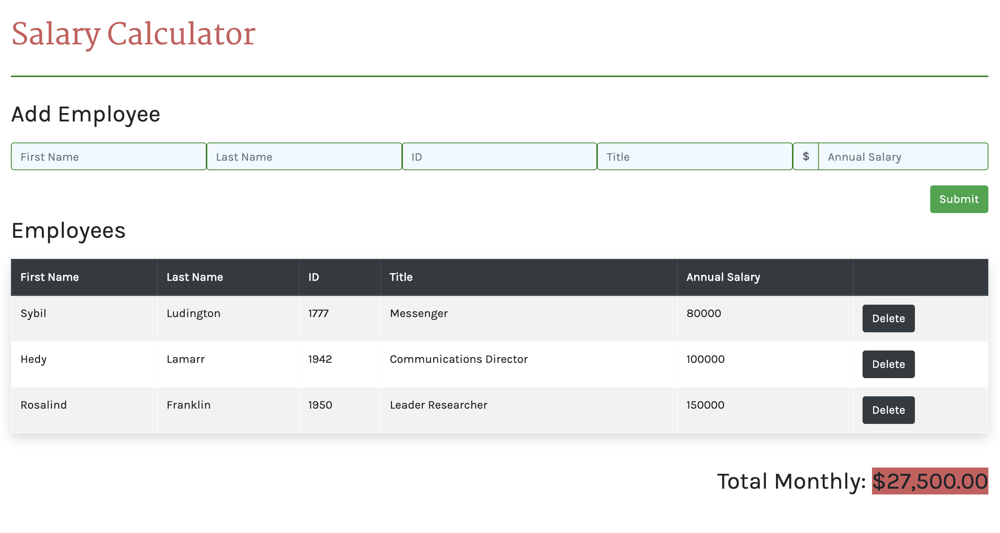

# Employee Salary Calculator

## Description

This application allows a business to keep track of current employee information and calculate the total monthly cost for employee salaries. It does this by collecting input employee information, storing the information in a table, and adding up employee salaries to report monthly costs. It also allows employees to be deleted from the table while simultaneously updating the total monthly cost.

## Screen Shot

## Installation
- Fork and clone repository

## Usage
1. User enters employee information. All inputs are required to move forward.
2. User clicks 'Submit' button
3. User can see the Total Monthly Cost in bottom right-hand corner and if the cost exceeds $20,000 then the background will turn red.
4. If an employee leaves or is terminated, the user can remove that employee from the table by clicking 'Delete'. The Total Monthly cost will be updated to reflect only current employees.

## Built With
- Javascript
- jQuery

## Acknowledgement
Thank you to Prime Digital Academy for equipping me with the knowledge and tools to create this application.